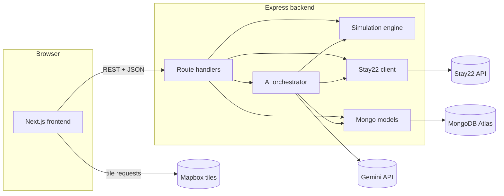

# Design Document

## Overview

Innsight is a pnpm workspace monorepo delivering an AI-powered hospitality investment
simulator. This design scaffolds the full project skeleton described in `CLAUDE.md` and the
22 requirements in `requirements.md`: a Next.js frontend, an Express backend housing the
simulation engine and AI orchestrator, and a shared `packages/config/` package holding the
tunable market lookup tables.

The scaffold is production-shaped but pre-tuning: real formulas, real integrations, real
validation at every boundary, but placeholder cost/impact numbers marked "tune later" so a
developer can run the full stack end-to-end as soon as the four external credentials
(Stay22, Gemini, Mapbox, MongoDB Atlas) are provisioned.

Three guiding principles run through every design decision:

- **Estimates, never facts.** Every predicted number that leaves the backend carries a
  `disclaimer` field, and every predicted number the frontend renders is labeled
  "estimated" adjacent to the value. No fabricated hotel data is ever introduced as a
  stand-in for Stay22.
- **Degrade, don't crash.** Missing credentials or unreachable dependencies flip the
  affected surface into a `not_configured` or `error` state that `GET /health` reports and
  affected routes return as HTTP 503. The scaffold boots cleanly with a completely empty
  `.env`.
- **Config-driven simulation.** ADR, Rating, and Opportunity Score all depend on lookup
  tables — amenity impact, competition weighting, cost tables — that ship as a typed
  package. Formula code contains no market constants.

The design maps every requirement to one or more concrete design elements: the file layout
in section 2, the interface signatures in section 3, and the invariants in section 5.

## Architecture

### Monorepo layout

```
innsight/
├── package.json                    # Root workspace scripts, engines, devDependencies
├── pnpm-workspace.yaml             # Declares frontend, backend, packages/*
├── tsconfig.base.json              # Strict-mode TS base extended by each workspace
├── .env.example                    # STAY22_API_KEY, GEMINI_API_KEY,
│                                   # MAPBOX_ACCESS_TOKEN, MONGODB_URI (empty)
├── .gitignore                      # node_modules, .env, .env.local, .next, dist
├── README.md                       # Layout, install/dev commands, integration checklists
│
├── packages/
│   └── config/
│       ├── package.json            # name: @innsight/config
│       ├── tsconfig.json
│       ├── src/
│       │   ├── index.ts            # Public re-exports + loadConfig() with zod validation
│       │   ├── amenityImpact.ts    # amenityImpactTable + amenityImpactCap
│       │   ├── competition.ts      # competitionWeighting parameters
│       │   ├── cost.ts             # costTable (per-room, per-amenity, renovation)
│       │   ├── operating.ts        # operatingMargin (default 0.32)
│       │   ├── risk.ts             # risk-component weights (volatility, cost, concentration)
│       │   ├── opportunity.ts      # opportunity-score weighted-sum weights
│       │   └── schemas.ts          # zod schemas for every exported table
│       └── README.md               # How to tune values; units and ranges
│
├── backend/
│   ├── package.json                # express, pino, mongoose, zod, @google/generative-ai
│   ├── tsconfig.json
│   ├── .env.example                # Backend-only vars documented
│   ├── README.md                   # Backend dev + env docs
│   ├── src/
│   │   ├── index.ts                # Entrypoint: load env, create app, listen
│   │   ├── app.ts                  # Express app factory (composition root)
│   │   ├── env.ts                  # zod-validated process.env → typed Env object
│   │   ├── logger.ts               # pino singleton, service="innsight-backend"
│   │   │
│   │   ├── middleware/
│   │   │   ├── requestLogger.ts    # method/path/status/duration on completion
│   │   │   ├── requestId.ts        # attaches req.id (nanoid); logged in every entry
│   │   │   ├── errorHandler.ts     # last-resort 500, hides stack, stable errorCode
│   │   │   └── cors.ts             # FRONTEND_ORIGIN allowlist
│   │   │
│   │   ├── routes/
│   │   │   ├── health.ts           # GET /health
│   │   │   ├── hotels.ts           # GET /hotels
│   │   │   ├── locations.ts        # GET /locations/opportunity-grid
│   │   │   ├── simulations.ts      # POST /simulations
│   │   │   └── ai.ts               # POST /ai/consult
│   │   │
│   │   ├── schemas/                # zod request/response schemas per route
│   │   │   ├── common.ts           # errorEnvelopeSchema, coordinateSchema
│   │   │   ├── hotel.ts
│   │   │   ├── simulation.ts       # simulateHotelInput + simulateHotelOutput
│   │   │   ├── grid.ts
│   │   │   └── ai.ts
│   │   │
│   │   ├── services/
│   │   │   ├── hotelService.ts     # Orchestrates Stay22 + Hotels collection
│   │   │   ├── simulationService.ts# Wraps simulation engine + Simulations collection
│   │   │   ├── locationService.ts  # Wraps opportunity-grid engine
│   │   │   └── healthService.ts    # Aggregates dependency readiness
│   │   │
│   │   ├── db/
│   │   │   ├── mongo.ts            # Connection lifecycle, readiness state machine
│   │   │   └── models/
│   │   │       ├── Hotel.ts        # Mongoose model + schema
│   │   │       ├── Location.ts
│   │   │       └── Simulation.ts
│   │   │
│   │   ├── stay22/
│   │   │   ├── client.ts           # Stay22Client class
│   │   │   ├── schemas.ts          # Envelope + per-record zod schemas
│   │   │   └── readiness.ts        # Reports "ready"|"not_configured" to healthService
│   │   │
│   │   ├── simulation/             # See section 3.5 for full module map
│   │   │   ├── index.ts            # simulateHotel + computeOpportunityGrid
│   │   │   ├── types.ts
│   │   │   ├── locationScore.ts
│   │   │   ├── qualityScore.ts
│   │   │   ├── amenityImpact.ts
│   │   │   ├── competition.ts
│   │   │   ├── adr.ts
│   │   │   ├── occupancy.ts
│   │   │   ├── revenue.ts
│   │   │   ├── rating.ts
│   │   │   ├── capex.ts
│   │   │   └── opportunityGrid.ts
│   │   │
│   │   └── ai/
│   │       ├── consultant.ts       # AIConsultant orchestrator
│   │       ├── gemini.ts           # Thin wrapper around @google/generative-ai
│   │       ├── tools/
│   │       │   ├── index.ts        # Tool registry
│   │       │   ├── simulateHotelChange.ts
│   │       │   ├── calculateRevenue.ts
│   │       │   ├── analyzeLocation.ts
│   │       │   ├── compareCompetitors.ts
│   │       │   └── generateInvestmentReport.ts
│   │       ├── schemas.ts          # Tool arg + return zod schemas, final response schema
│   │       └── systemInstruction.ts# Estimate-framing system prompt
│   └── vitest.config.ts
│
└── frontend/
    ├── package.json                # next, react, tailwindcss, zod, mapbox-gl, deck.gl
    ├── tsconfig.json
    ├── next.config.mjs
    ├── tailwind.config.ts
    ├── postcss.config.mjs
    ├── .env.example                # NEXT_PUBLIC_* placeholders
    ├── README.md                   # Frontend dev + env docs
    ├── app/
    │   ├── layout.tsx              # Root layout + SessionProvider + AIConsultantProvider
    │   ├── page.tsx                # Landing
    │   ├── discover/page.tsx       # Market Discovery
    │   └── sandbox/page.tsx        # Hotel Sandbox
    ├── components/
    │   ├── shared/                 # EstimateLabel, Stay22Attribution, ErrorBanner, Panel
    │   ├── discover/               # DiscoverMap, HotelMarkerTooltip, HeatmapTooltip,
    │   │                           # MapNotConfigured
    │   ├── sandbox/                # SandboxForm, MetricsPanel, MetricCard
    │   └── consultant/             # ConsultantPanel, PromptForm, AiNotConfigured,
    │                               # ConsultantMessage (plain text; no bubbles)
    ├── lib/
    │   ├── api/
    │   │   ├── client.ts           # fetchJson<T> with zod validation
    │   │   ├── hotels.ts
    │   │   ├── simulations.ts
    │   │   ├── locations.ts
    │   │   ├── ai.ts
    │   │   └── schemas.ts          # Response zod schemas mirroring backend
    │   ├── log.ts                  # Gated debug logger
    │   ├── session.ts              # nanoid-based session id (localStorage)
    │   └── debounce.ts             # Small in-flight-limited debouncer for sandbox
    ├── contexts/
    │   ├── SessionContext.tsx      # sessionId
    │   └── AIConsultantContext.tsx # panel open/closed, current deltas
    └── vitest.config.ts
```

### Runtime topology



The frontend never talks to Stay22, Gemini, or MongoDB directly. Mapbox is the sole
external service the frontend calls (for tiles), gated behind
`NEXT_PUBLIC_MAPBOX_ACCESS_TOKEN`.

### Degraded-mode behavior

Every external dependency has three readiness states surfaced through `GET /health`:

| Dependency | `ready`                                    | `not_configured`                     | `error`                                            |
|------------|--------------------------------------------|--------------------------------------|----------------------------------------------------|
| MongoDB    | Driver connected, ping succeeded           | `MONGODB_URI` unset                  | URI set but connect/ping failed                    |
| Stay22     | `STAY22_API_KEY` set                       | `STAY22_API_KEY` unset               | Last N requests all errored/timed out (soft)       |
| Gemini     | `GEMINI_API_KEY` set                       | `GEMINI_API_KEY` unset               | Last request errored non-4xx (soft)                |

Routes react to dependency state as follows:

- `GET /hotels` returns HTTP 200 with an empty array when Stay22 is `not_configured`, so the
  Discover view renders "no hotels yet" without breaking.
- `POST /simulations` and `GET /locations/opportunity-grid` return HTTP 503
  `errorCode: "database_unavailable"` when MongoDB is `not_configured` or `error`
  (simulations require persistence per Requirement 4.8; the grid endpoint reads
  `Locations`).
- `POST /ai/consult` returns HTTP 503 `errorCode: "ai_not_configured"` when Gemini is
  `not_configured`.

Startup never crashes on missing env; it logs a structured `warn` per missing variable and
proceeds.

### Request lifecycle (backend)

1. `requestId` middleware attaches a `nanoid` request id to `req.id` and to a child
   `pino` logger on `req.log`.
2. Route-level zod validation of request params / body / query; invalid input returns
   HTTP 400 `errorCode: "invalid_request"` with the field-level errors in
   `details.issues`.
3. Handler delegates to a service (never touches Mongo or Stay22 directly).
4. Handler validates the service's return value against a response zod schema.
5. `requestLogger` writes the completion entry with `{method, path, status, durationMs,
   requestId}` on the `finish` event.
6. `errorHandler` catches any thrown error, logs it at `error` with stack, returns 500
   `{errorCode: "internal_error", message: "Unexpected server error"}`.

### Frontend request lifecycle

1. Feature component calls a typed method on `lib/api/*` (e.g. `simulationsApi.create`).
2. `fetchJson<T>` in `lib/api/client.ts` issues the request with
   `Content-Type: application/json`, throws `ApiError` on non-2xx after parsing
   `{errorCode, message, details}`.
3. Response is parsed with the route's zod schema; a validation failure logs `warn`
   through `lib/log.ts` and throws a synthetic `ApiError({errorCode:
   "response_validation_failed"})` that the feature component renders as an inline banner
   (Requirement 17.6).
4. Feature component updates local state / context; the AI Consultant panel forwards any
   `hotelDelta` or `simulationDelta` returned by `/ai/consult` to the active view via
   `AIConsultantContext`.

## Components and Interfaces

### 3.1 Backend composition root (`backend/src/app.ts`)

```ts
export function createApp(deps: AppDependencies): express.Express {
  const app = express();
  app.use(cors(corsOptionsFromEnv(deps.env)));
  app.use(express.json({ limit: "1mb" }));
  app.use(requestIdMiddleware());
  app.use(requestLoggerMiddleware(deps.logger));
  app.use("/health", healthRouter(deps));
  app.use("/hotels", hotelsRouter(deps));
  app.use("/locations", locationsRouter(deps));
  app.use("/simulations", simulationsRouter(deps));
  app.use("/ai", aiRouter(deps));
  app.use(notFoundHandler);
  app.use(errorHandlerMiddleware(deps.logger));
  return app;
}

export interface AppDependencies {
  env: Env;
  logger: pino.Logger;
  mongo: MongoConnection;         // holds readiness + models
  stay22: Stay22Client;
  simulation: SimulationEngine;
  ai: AIConsultant;
}
```

Dependencies are constructed once in `src/index.ts` and passed into `createApp`. This
makes each router unit-testable with fakes and avoids the "import graph is the DI graph"
problem.

### 3.2 Health check (`GET /health`)

```ts
type Readiness = "ready" | "not_configured" | "error";

interface HealthResponse {
  status: "ok" | "degraded";
  uptimeSeconds: number;
  dependencies: {
    mongodb: Readiness;
    stay22:  Readiness;
    gemini:  Readiness;
  };
}
```

`status` is `"ok"` iff every dependency is `"ready"`, else `"degraded"`. Health never
returns 5xx — it always reports state.

### 3.3 pino logger (`backend/src/logger.ts`)

```ts
export const logger = pino({
  level: env.LOG_LEVEL ?? "info",
  base: { service: "innsight-backend" },
  redact: ["req.headers.authorization", "res.headers['set-cookie']"],
  formatters: { level: (label) => ({ level: label }) },
});
```

Every log entry carries at least `{service, level, time, msg}`; entries emitted during a
request additionally carry `{requestId, route}`. Route handlers use `req.log` (a child
logger) rather than the module-level singleton so `requestId` is always present.

### 3.4 Stay22 client (`backend/src/stay22/`)

Envelope schema (illustrative — Stay22's exact wire format is confirmed at integration
time; the client validates whatever shape the docs describe and discards records that fail
the per-record schema):

```ts
// stay22/schemas.ts
export const stay22HotelSchema = z.object({
  id: z.string().min(1),
  name: z.string().min(1),
  supplier: z.string().min(1),
  coordinates: z.object({
    lat: z.number().gte(-90).lte(90),
    lng: z.number().gte(-180).lte(180),
  }),
  city: z.string().optional(),
  country: z.string().optional(),
  stars: z.number().int().gte(1).lte(5).optional(),
  rating: z.number().gte(0).lte(5).optional(),
  price: z.object({
    amount: z.number().nonnegative(),
    currency: z.string().length(3),
    per: z.enum(["night", "stay"]).default("night"),
  }).optional(),
  amenities: z.array(z.string()).default([]),
  images: z.array(z.string().url()).default([]),
  bookingUrl: z.string().url().optional(),
});

export const stay22EnvelopeSchema = z.object({
  hotels: z.array(z.unknown()),   // per-record validation happens after envelope
  meta: z.object({
    total: z.number().int().nonnegative().optional(),
  }).optional(),
});

export type Stay22Hotel = z.infer<typeof stay22HotelSchema>;
```

Client interface:

```ts
export interface Stay22SearchOptions {
  timeoutMs?: number;             // default 10_000
  signal?: AbortSignal;
}

export interface Stay22Client {
  readonly readiness: Readiness;  // "ready" | "not_configured" (soft "error" tracked)
  searchByCity(
    city: string,
    opts?: Stay22SearchOptions,
  ): Promise<Stay22Hotel[]>;
  searchByBoundingBox(
    bbox: { north: number; south: number; east: number; west: number },
    opts?: Stay22SearchOptions,
  ): Promise<Stay22Hotel[]>;
  searchByRadius(
    center: { lat: number; lng: number },
    radiusKm: number,
    opts?: Stay22SearchOptions,
  ): Promise<Stay22Hotel[]>;
}
```

Behavior:

- Every method returns `[]` when `readiness === "not_configured"`, after logging `warn`.
- Every method enforces a 10-second timeout via `AbortController` (Requirement 5.7).
- On response, the client parses with `stay22EnvelopeSchema` first. Envelope failure →
  `logger.error` with issues + return `[]` (Requirement 5.5).
- For each record in `envelope.hotels`, the client parses with `stay22HotelSchema`.
  Record-level failure → `logger.warn` with the record's index and issues, then skip
  (Requirement 5.4). Successful records are returned as `Stay22Hotel[]`.
- The client attaches `Authorization: Bearer <STAY22_API_KEY>` (or Stay22's documented
  header; adjustable in one place) to every request.
- No fabricated data path: if a caller wants "sample hotels," it gets `[]` until keys are
  present (Requirement 5.8).

### 3.5 Simulation engine (`backend/src/simulation/`)

Module map and public signatures:

```ts
// simulation/types.ts
export type HotelType = "budget" | "midscale" | "upscale" | "luxury" | "resort" | "extended_stay";
export type LocationType = "downtown" | "airport" | "resort" | "business_district" | "suburban";

export interface LocationScores {
  transit: number;         // 0..1
  airport: number;         // 0..1
  tourism: number;         // 0..1
  business: number;        // 0..1
}

export interface HotelConfig {
  hotelType: HotelType;
  rooms: number;                 // non-negative integer
  stars: 1|2|3|4|5;
  modernity: number;             // 0..1 (0=needs renovation, 1=brand new)
  renovationDelta: number;       // 0..1 renovation intended (for CapEx only)
  amenities: string[];           // e.g. ["pool","spa","gym"]
  targetSegment: "leisure" | "business" | "mixed";
  basePrice: number;             // USD, from city context
  segmentAdrNorm: number;        // USD, segment-normal ADR from city context
  location: {
    type: LocationType;
    scores: LocationScores;
    coordinates: { lat: number; lng: number };
    baseDemand: number;          // percentage points, city-average baseline occupancy
    locationDemand: number;      // percentage points delta
    locationSatisfaction: number;// rating points delta
  };
  competitors: CompetitorHotel[];// nearby validated Stay22 records
  baseRating: number;            // typically 3.5
}

export interface SimulateHotelOutput {
  adr: number;                   // > 0
  occupancy: number;             // 0..100
  revenue: number;               // ≥ 0
  rating: number;                // 1.0..5.0
  investment: number;            // ≥ 0
  annualOperatingProfit: number; // ≥ 0
  roi: number;                   // ≥ 0
  paybackYears: number;          // > 0 or Number.POSITIVE_INFINITY
  intermediates: {
    locationMultiplier: number;
    qualityMultiplier: number;
    amenityImpactPct: number;    // in [-cap, +cap]
    competitionPressure: number; // percentage points
    amenitySatisfaction: number; // rating points
    priceExpectationPenalty: number;
  };
  disclaimer: string;            // always the fixed estimate-framing string
}

// simulation/index.ts
export interface SimulationEngine {
  simulateHotel(input: HotelConfig): SimulateHotelOutput;
  computeOpportunityGrid(input: OpportunityGridInput): OpportunityGridOutput;
}

export function createSimulationEngine(config: LoadedConfig, logger: pino.Logger)
  : SimulationEngine;
```

`simulateHotel` composes the pure sub-modules in the **computation order** mandated by
Requirement 7.1:

```
locationMultiplier = locationScore(input.location.scores)
qualityMultiplier  = qualityScore(input.stars, input.modernity)          // Rating-free
amenityPctRaw      = amenityImpact.aggregate(
                         input.amenities,
                         { hotelType: input.hotelType,
                           locationType: input.location.type },
                         config.amenityImpactTable)
amenityPct         = clamp(amenityPctRaw, -cap, +cap)                     // cap = 25pp
competitionPP      = competition.pressure(input, input.competitors, config.competitionWeighting)
adr                = adrFormula(input.basePrice, locationMultiplier,
                                 qualityMultiplier, amenityPct)
occupancy          = occupancyFormula(input.location.baseDemand,
                                       input.location.locationDemand,
                                       hotelQualityFrom(input),
                                       amenityMatchFrom(amenityPct),
                                       competitionPP)
revenue            = revenueFormula(input.rooms, adr, occupancy)
rating             = ratingFormula(input.baseRating,
                                    amenitySatisfactionFrom(amenityPct),
                                    input.location.locationSatisfaction,
                                    priceExpectationPenalty(adr, input.segmentAdrNorm))
investment         = capex.investment(input, config.costTable)
opProfit           = revenue * config.operatingMargin
roi                = capex.roi(opProfit, investment)
paybackYears       = capex.payback(opProfit, investment)
```

The `amenityImpact` module and `competition` module are **shared** — both `adr` and
`rating` receive `amenityPct` from the same aggregation; both `occupancy` and
`opportunityGrid` receive `competitionPP` from the same pressure function. Amenity
aggregation is:

```ts
// simulation/amenityImpact.ts
export function aggregate(
  amenities: string[],
  context: { hotelType: HotelType; locationType: LocationType },
  table: AmenityImpactTable,
): number {
  return amenities.reduce((sum, a) => {
    const pp = table[a]?.[context.hotelType]
            ?? table[a]?.[context.locationType]
            ?? table[a]?._default
            ?? 0;
    return sum + pp;
  }, 0);
}
export function cap(raw: number, capPP: number): number {
  return Math.max(-capPP, Math.min(capPP, raw));
}
```

Formula wiring:

```ts
// simulation/adr.ts — Requirement 8
export function adrFormula(
  basePrice: number,
  locationMultiplier: number,
  qualityMultiplier: number,
  cappedAmenityPct: number,   // e.g. 0.18 for +18%
): number {
  const adr = basePrice * locationMultiplier * qualityMultiplier * (1 + cappedAmenityPct / 100);
  if (!Number.isFinite(adr) || adr <= 0) {
    throw new SimulationError("adr_non_positive", { basePrice, locationMultiplier, qualityMultiplier, cappedAmenityPct });
  }
  return adr;
}

// simulation/qualityScore.ts — Requirement 8.2 (no rating input)
export function qualityScore(stars: 1|2|3|4|5, modernity: number): number {
  // Deterministic function of stars + modernity ∈ [0,1]. No dependence on predicted rating.
  const starBase = { 1: 0.65, 2: 0.80, 3: 1.00, 4: 1.25, 5: 1.55 }[stars];
  const modernityBoost = 0.85 + 0.30 * clamp01(modernity);   // 0.85..1.15
  return starBase * modernityBoost;
}

// simulation/occupancy.ts — Requirement 9 (clamp to [0,100])
export function occupancyFormula(
  baseDemand: number, locationDemand: number, hotelQuality: number,
  amenityMatch: number, competitionPressure: number,
): number {
  const raw = baseDemand + locationDemand + hotelQuality + amenityMatch - competitionPressure;
  if (!Number.isFinite(raw)) {
    throw new SimulationError("occupancy_non_finite", { baseDemand, locationDemand, hotelQuality, amenityMatch, competitionPressure });
  }
  return Math.max(0, Math.min(100, raw));
}

// simulation/revenue.ts — Requirement 10
export function revenueFormula(rooms: number, adr: number, occupancyPct: number): number {
  if (!Number.isInteger(rooms) || rooms < 0) {
    throw new SimulationError("rooms_invalid", { rooms });
  }
  return rooms * adr * (occupancyPct / 100) * 365;   // rooms=0 → 0, no error (Req 10.4)
}

// simulation/rating.ts — Requirement 11 (clamp to [1.0, 5.0])
export function priceExpectationPenalty(adr: number, segmentAdrNorm: number): number {
  if (segmentAdrNorm <= 0) return 0;                 // guard: don't penalize when norm unknown
  const ratio = adr / segmentAdrNorm;
  // Overpriced → penalty grows; underpriced → mild positive penalty (i.e. small bonus).
  // Deterministic monotone map from ratio to penalty in rating points.
  return Math.max(-0.25, 0.5 * Math.log(ratio));
}
export function ratingFormula(
  baseRating: number, amenitySatisfaction: number,
  locationSatisfaction: number, penalty: number,
): number {
  const raw = baseRating + amenitySatisfaction + locationSatisfaction - penalty;
  return Math.max(1.0, Math.min(5.0, raw));
}

// simulation/capex.ts — Requirement 12
export function investmentFormula(input: HotelConfig, costTable: CostTable): number {
  const perRoom       = costTable.perRoom[input.hotelType][input.stars];
  const amenityCost   = input.amenities.reduce((s, a) => s + (costTable.perAmenity[a] ?? 0), 0);
  const renovation    = costTable.renovationPerRoom * input.rooms * input.renovationDelta;
  const total         = perRoom * input.rooms + amenityCost + renovation;
  if (!Number.isFinite(total) || total < 0) {
    throw new SimulationError("investment_invalid", { total });
  }
  return total;
}
export function roi(profit: number, investment: number): number {
  if (investment <= 0) throw new SimulationError("investment_non_positive", { investment });
  if (profit === 0)    return 0;                        // Requirement 12.6
  return profit / investment;
}
export function payback(profit: number, investment: number): number {
  if (investment <= 0) throw new SimulationError("investment_non_positive", { investment });
  if (profit === 0)    return Number.POSITIVE_INFINITY; // Requirement 12.6
  return investment / profit;
}
```

Opportunity grid (`opportunityGrid.ts`) — Requirement 13:

```ts
export interface OpportunityGridInput {
  city: string;
  gridSize: number;               // e.g. 20 → 20x20 cells over city bbox
  cityBbox: { north: number; south: number; east: number; west: number };
  competitors: CompetitorHotel[]; // Stay22 records covering the whole bbox
  cellContextResolver: (coord: { lat:number; lng:number }) =>
    Pick<HotelConfig, "basePrice" | "segmentAdrNorm" | "location"> & {
      volatility: number;
      relConstructionCost: number;
      demandConcentration: number;
    };
}

export interface OpportunityCell {
  coordinates: { lat:number; lng:number };
  components: {
    revenuePotential: number;             // raw (USD-scale)
    demand: number;                        // raw (percentage points)
    segmentWeightedCompetition: number;    // raw
    risk: number;                          // raw
  };
  normalized: {                            // 0..100 after min-max
    revenuePotential: number;
    demand: number;
    segmentWeightedCompetition: number;
    risk: number;
  };
  opportunityScore: number;                // 0..100 clamped
}

export function computeOpportunityGrid(
  input: OpportunityGridInput,
  config: LoadedConfig,
): OpportunityCell[];
```

Algorithm (three passes, matching Requirement 13.2/13.3/13.4/13.6):

1. **Raw pass.** For every grid cell, compute a *hypothetical* hotel using a
   representative typology and the cell's context. Derive:
   - `revenuePotential` = a lightweight ADR × baseline occupancy estimate for that cell.
   - `demand` = `baseDemand + locationDemand`.
   - `segmentWeightedCompetition` = `competition.pressure(...)` using the shared module.
   - `risk` = `wVol × volatility + wCost × relConstructionCost + wConc × demandConcentration`,
     where `wVol/wCost/wConc` come from `config.risk`.

2. **Normalize.** Min-max normalize each of the four components across the grid to `[0,100]`.
   **Fallback:** if any component is constant across the grid (max − min ≤ ε), or if the
   grid is empty, set every cell's `opportunityScore` to `50`, log `warn`, and skip the
   weighted sum (Requirement 13.6).

3. **Combine.** For each cell:
   `score = w1 × norm.revenue + w2 × norm.demand − w3 × norm.competition − w4 × norm.risk`,
   using weights from `config.opportunityWeights`, then `clamp(0, 100, score)`.

**Bounds-check zod schema for outputs** (used by the backend response validator, Req 14):

```ts
export const simulateHotelOutputSchema = z.object({
  adr:                   z.number().finite().positive(),
  occupancy:             z.number().finite().gte(0).lte(100),
  revenue:               z.number().finite().nonnegative(),
  rating:                z.number().finite().gte(1.0).lte(5.0),
  investment:            z.number().finite().nonnegative(),
  annualOperatingProfit: z.number().finite().nonnegative(),
  roi:                   z.number().finite().nonnegative(),
  paybackYears: z.union([
    z.number().finite().positive(),
    z.literal(Number.POSITIVE_INFINITY),
  ]),
  intermediates: z.object({
    locationMultiplier:       z.number().finite().positive(),
    qualityMultiplier:        z.number().finite().positive(),
    amenityImpactPct:         z.number().finite(),
    competitionPressure:      z.number().finite(),
    amenitySatisfaction:      z.number().finite(),
    priceExpectationPenalty:  z.number().finite(),
  }),
  disclaimer: z.literal("All predicted metrics are simulation estimates and not real financial data."),
});

export const opportunityCellSchema = z.object({
  coordinates: z.object({ lat: z.number(), lng: z.number() }),
  components: z.object({ /* raw numbers, unbounded */ }),
  normalized: z.object({ /* each: z.number().gte(0).lte(100) */ }),
  opportunityScore: z.number().gte(0).lte(100),
});
```

### 3.6 AI Consultant orchestrator (`backend/src/ai/`)

Gemini client setup:

```ts
// ai/gemini.ts
export function createGeminiClient(env: Env): GeminiClient | null {
  if (!env.GEMINI_API_KEY) return null;                          // Requirement 15.6
  const genAI = new GoogleGenerativeAI(env.GEMINI_API_KEY);
  return genAI.getGenerativeModel({
    model: env.GEMINI_MODEL ?? "gemini-1.5-pro",
    systemInstruction: SYSTEM_INSTRUCTION,                        // Requirement 22.5
    tools: [{ functionDeclarations: TOOL_DECLARATIONS }],
    toolConfig: { functionCallingConfig: { mode: "AUTO" } },
  });
}
```

System instruction (`systemInstruction.ts`) — abridged, hardcoded in repo:

> "You are Innsight's hospitality consultant. Every predicted number you cite — ADR,
> occupancy, revenue, rating, ROI, payback, opportunity score — MUST be described as an
> 'estimate' or 'simulation'. Never present a predicted figure as a real, observed, or
> guaranteed value. When you cite hotel inventory data (price, name, star rating,
> amenities), attribute it explicitly to 'Stay22'. Use the provided tools rather than
> asserting numeric answers from memory."

Tool registry:

```ts
// ai/tools/index.ts
export interface Tool<Args, Result> {
  name: string;
  description: string;
  argsSchema: z.ZodType<Args>;
  resultSchema: z.ZodType<Result>;
  handler(args: Args, ctx: ToolContext): Promise<Result>;
}

export const TOOLS = [
  simulateHotelChangeTool,
  calculateRevenueTool,
  analyzeLocationTool,
  compareCompetitorsTool,
  generateInvestmentReportTool,
];
```

Each tool has a zod arg schema and a zod result schema. Illustrative signatures:

| Tool | Args (zod) | Result (zod) |
|------|------------|--------------|
| `simulateHotelChange`   | `{ base: HotelConfig, changes: Partial<HotelConfig> }` | `{ before: SimulateHotelOutput, after: SimulateHotelOutput }` |
| `calculateRevenue`      | `{ config: HotelConfig }` | `{ revenue: number, breakdown: {...} }` |
| `analyzeLocation`       | `{ city: string, coordinates?: {lat,lng} }` | `{ scores: LocationScores, opportunityCells: OpportunityCell[] }` |
| `compareCompetitors`    | `{ hotel: HotelConfig, radiusKm: number }` | `{ competitors: CompetitorSummary[], segmentPressure: number }` |
| `generateInvestmentReport` | `{ config: HotelConfig }` | `{ investment, roi, paybackYears, narrativeSummary: string }` |

Dispatch loop:

```ts
// ai/consultant.ts
export async function consult(
  gemini: GeminiClient, tools: Tool<any,any>[],
  request: { sessionId: string; prompt: string; context?: unknown },
  ctx: ToolContext, logger: pino.Logger,
): Promise<AiConsultResponse> {
  if (!gemini) throw new HttpError(503, "ai_not_configured");

  let chat = gemini.startChat({ history: buildHistory(request) });
  let deltas: Deltas = {};

  for (let round = 0; round < 6; round++) {                       // Requirement 15.7
    const resp = await chat.sendMessage(round === 0 ? request.prompt : "");
    const calls = extractFunctionCalls(resp);

    if (calls.length === 0) {
      const final = extractText(resp);
      return aiConsultResponseSchema.parse({                       // Requirement 15.5
        message: final,
        deltas,
        disclaimer: DISCLAIMER,
      });
    }

    const results = await Promise.all(calls.map(async (call) => {
      const tool = tools.find(t => t.name === call.name);
      if (!tool) return errorResult(call, "unknown_tool");
      const parsed = tool.argsSchema.safeParse(call.args);
      if (!parsed.success) {                                       // Requirement 15.4
        logger.warn({ tool: call.name, issues: parsed.error.issues }, "tool args invalid");
        return errorResult(call, "invalid_args", parsed.error.issues);
      }
      const result = await tool.handler(parsed.data, ctx);
      mergeDeltas(deltas, result);
      return { name: call.name, response: tool.resultSchema.parse(result) };
    }));

    chat = chat.continueWith(results);
  }

  logger.warn({ sessionId: request.sessionId }, "ai tool-call budget exhausted");
  return aiConsultResponseSchema.parse({
    message: "I ran out of thinking budget before finishing that request. Try narrowing the question.",
    deltas,
    disclaimer: DISCLAIMER,
  });
}
```

Final-response zod schema (Requirement 15.5):

```ts
export const aiConsultResponseSchema = z.object({
  message: z.string().min(1),
  deltas: z.object({
    hotel:      z.record(z.unknown()).optional(),
    simulation: simulateHotelOutputSchema.partial().optional(),
  }).default({}),
  disclaimer: z.literal(DISCLAIMER),
});
```

### 3.7 HTTP API surface

| Method | Path | Request | Response | Notes |
|-------|------|---------|----------|-------|
| GET  | `/health` | — | `HealthResponse` | never 5xx |
| GET  | `/hotels` | query: `city?` \| `bbox?` \| (`center` + `radiusKm`) | `{ hotels: Stay22Hotel[] }` | `[]` if Stay22 not configured |
| GET  | `/locations/opportunity-grid` | query: `city`, `gridSize?` (default 20) | `{ cells: OpportunityCell[] }` | 503 if DB down |
| POST | `/simulations` | body: `HotelConfig` | `{ result: SimulateHotelOutput, simulationId: string }` | persists to `Simulations` |
| POST | `/ai/consult` | body: `{ sessionId: string; prompt: string; context?: unknown }` | `{ message, deltas, disclaimer }` | 503 if Gemini not configured |

Error envelope (Requirement 3.5, 4.8, 14.2, 15.6, 16.5):

```ts
export const errorEnvelopeSchema = z.object({
  errorCode: z.enum([
    "invalid_request",
    "database_unavailable",
    "ai_not_configured",
    "simulation_output_invalid",
    "internal_error",
    "response_validation_failed",
  ]),
  message: z.string(),
  details: z.unknown().optional(),
});
```

Route handler pattern:

```ts
router.post("/", async (req, res, next) => {
  const parsed = hotelConfigSchema.safeParse(req.body);
  if (!parsed.success) {
    return res.status(400).json({
      errorCode: "invalid_request",
      message: "Request body failed validation.",
      details: { issues: parsed.error.issues },
    });
  }
  if (deps.mongo.readiness !== "ready") {
    return res.status(503).json({
      errorCode: "database_unavailable",
      message: "MongoDB is not available.",
    });
  }
  try {
    const output = deps.simulation.simulateHotel(parsed.data);
    const validated = simulateHotelOutputSchema.safeParse(output);
    if (!validated.success) {
      req.log.error({ input: parsed.data, issues: validated.error.issues }, "simulation output invalid");
      return res.status(500).json({
        errorCode: "simulation_output_invalid",
        message: "Simulation produced an out-of-bounds result.",
      });
    }
    const id = await deps.mongo.models.Simulation.persist(req.body, validated.data, req.body.sessionId);
    res.json({ result: validated.data, simulationId: id });
  } catch (err) { next(err); }
});
```

### 3.8 Frontend components and integration points

Component tree (feature-grouped, plain HTML + Tailwind — Requirement 17.2/17.3/17.4):

```
components/
├── shared/
│   ├── EstimateLabel.tsx        // <span class="text-xs uppercase tracking-wide text-slate-500">estimated</span>
│   ├── Stay22Attribution.tsx    // "source: Stay22"
│   ├── ErrorBanner.tsx          // inline, non-modal
│   ├── Panel.tsx                // sliding side panel (not full-screen)
│   └── FormField.tsx            // <label>+<input>, no design-system dependency
├── discover/
│   ├── DiscoverMap.tsx          // Mapbox GL + deck.gl
│   ├── HotelLayer.tsx           // ScatterplotLayer from GET /hotels
│   ├── OpportunityLayer.tsx     // GridCellLayer from /locations/opportunity-grid
│   ├── HotelMarkerTooltip.tsx   // name + stars + Stay22 price w/ attribution
│   ├── HeatmapTooltip.tsx       // opportunityScore + components, all labeled estimate
│   └── MapNotConfigured.tsx     // Requirement 18.6
├── sandbox/
│   ├── SandboxForm.tsx          // hotelType, rooms, stars, modernity, audience, amenity toggles
│   ├── MetricsPanel.tsx         // grid of MetricCard
│   ├── MetricCard.tsx           // value + EstimateLabel
│   └── ChangeSummary.tsx        // shows before/after when AI applies deltas
└── consultant/
    ├── ConsultantPanel.tsx      // collapsible side panel; never full-screen
    ├── PromptForm.tsx           // simple <textarea> + submit
    ├── ConsultantMessage.tsx    // plain <p>, no bubble/avatar/typing dots
    └── AiNotConfigured.tsx      // Requirement 20.5
```

Typed API client (`lib/api/`):

```ts
// lib/api/client.ts
export async function fetchJson<T>(
  url: string, init: RequestInit, schema: z.ZodType<T>,
): Promise<T> {
  const res = await fetch(url, {
    ...init,
    headers: { "Content-Type": "application/json", ...(init.headers ?? {}) },
  });
  if (!res.ok) {
    const body = errorEnvelopeSchema.safeParse(await res.json().catch(() => ({})));
    throw new ApiError(body.success ? body.data : {
      errorCode: "internal_error", message: `HTTP ${res.status}`,
    });
  }
  const raw = await res.json();
  const parsed = schema.safeParse(raw);
  if (!parsed.success) {
    log.warn("response validation failed", { url, issues: parsed.error.issues });
    throw new ApiError({
      errorCode: "response_validation_failed",
      message: "Backend response did not match expected shape.",
      details: parsed.error.issues,
    });
  }
  return parsed.data;
}
```

Gated debug logger (`lib/log.ts` — Requirement 21):

```ts
const DEBUG = typeof process !== "undefined" && process.env.NEXT_PUBLIC_DEBUG === "true";
export const log = {
  debug: (...a: unknown[]) => { if (DEBUG) console.debug("[innsight]", ...a); },
  info:  (...a: unknown[]) => { if (DEBUG) console.info("[innsight]",  ...a); },
  warn:  (...a: unknown[]) => { console.warn("[innsight]", ...a); },
  error: (...a: unknown[]) => { console.error("[innsight]", ...a); },
};
```

Contexts:

- `SessionContext` — generates a nanoid on first client render, persists to
  `localStorage["innsight_session"]`, exposes `{ sessionId }`. Used as `Simulations.sessionId`
  and `POST /ai/consult` `sessionId`.
- `AIConsultantContext` — `{ isOpen, open(), close(), lastDeltas, applyDeltas(deltas) }`.
  Discover and Sandbox pages subscribe to `lastDeltas` and re-render when the AI applies
  changes (Requirement 20.3).

Debounce (`lib/debounce.ts`) — Requirement 19.4:

```ts
export function createInFlightDebouncer<T>(minIntervalMs: number) {
  let last = 0; let inflight: Promise<T> | null = null;
  return async function run(op: () => Promise<T>): Promise<T | null> {
    const now = Date.now();
    if (inflight || now - last < minIntervalMs) return null;   // caller retains last result
    inflight = op(); last = now;
    try { return await inflight; } finally { inflight = null; }
  };
}
```

Mapbox + deck.gl integration (Discover — Requirement 18):

- `DiscoverMap` initializes `mapboxgl.Map` with `NEXT_PUBLIC_MAPBOX_ACCESS_TOKEN`. If the
  token is missing, renders `<MapNotConfigured />` instead of touching the SDK.
- Two deck.gl overlays via `MapboxOverlay`: a `ScatterplotLayer` for hotels (data from
  `hotelsApi.list`) and a `GridCellLayer` for the opportunity grid (data from
  `locationsApi.opportunityGrid`).
- Tooltips are plain HTML overlays styled with Tailwind — no third-party tooltip lib.

### 3.9 Environment / setup (Requirement 2)

Root `.env.example` (copy to `.env` at repo root; each workspace also reads its own):

```
# Root .env.example — copied to .env; picked up via dotenv in backend and Next.js
STAY22_API_KEY=
GEMINI_API_KEY=
GEMINI_MODEL=gemini-1.5-pro
MAPBOX_ACCESS_TOKEN=
MONGODB_URI=

# Backend
PORT=4000
LOG_LEVEL=info
FRONTEND_ORIGIN=http://localhost:3000

# Frontend (also duplicated in frontend/.env.local as NEXT_PUBLIC_*)
NEXT_PUBLIC_BACKEND_URL=http://localhost:4000
NEXT_PUBLIC_MAPBOX_ACCESS_TOKEN=
NEXT_PUBLIC_DEBUG=false
```

README setup checklists (Requirement 2.6-2.9) — each is a short numbered list ending with
"paste the value into `.env`":

- **Stay22**: request API access via the Stay22 partner portal → confirm email →
  copy the issued key into `STAY22_API_KEY`. Manual: request approval; Stay22 does not
  self-serve.
- **Gemini**: sign in to Google AI Studio → *Get API key* → new project → copy into
  `GEMINI_API_KEY`. Model identifier: `gemini-1.5-pro` (override with `GEMINI_MODEL`).
  Manual: accept AI Studio terms.
- **Mapbox**: create a Mapbox account → *Access tokens* → new token with scopes
  `styles:read`, `fonts:read`, `datasets:read`, `vision:read` → restrict `URLs` to
  `http://localhost:3000/*` (add prod domains later) → copy into
  `NEXT_PUBLIC_MAPBOX_ACCESS_TOKEN`. Manual: token restriction is browser-visible; only
  domain restriction protects it.
- **MongoDB Atlas**: sign up → create free-tier cluster (M0) → *Database Access* → new
  user with `readWrite` on `innsight` DB → *Network Access* → add current IP (or
  `0.0.0.0/0` for hackathon) → *Connect* → *Drivers* → copy connection string into
  `MONGODB_URI`, substituting the password. Manual: user creation, IP allowlist, and
  password substitution are all user-side.

### 3.10 Cross-cutting concerns

- **Estimate framing**: the backend always includes
  `disclaimer: "All predicted metrics are simulation estimates and not real financial data."`
  in every simulation response (Requirement 22.3). The frontend renders every simulation
  value inside a `<MetricCard>` that wraps it with `<EstimateLabel />`. If a response
  arrives without a `disclaimer`, the fallback label renders anyway and `log.warn` fires
  (Requirement 22.4).
- **Stay22 attribution**: every Stay22-sourced value in the UI is adjacent to a
  `<Stay22Attribution />` (Requirement 22.2). The AI system instruction requires the same
  attribution in text output (Requirement 22.5).
- **Session id**: generated client-side on first render (`nanoid`), persisted in
  `localStorage`, sent with `POST /simulations` and `POST /ai/consult`.
- **Debouncing**: `createInFlightDebouncer(250)` in Sandbox — at most one in-flight
  request per 250 ms window, previous metrics retained on error.
- **Logging conventions**: backend logs always carry `{service:"innsight-backend"}`;
  request-scoped logs carry `{requestId, route, method}`; tool-call logs carry
  `{tool, sessionId}`; simulation-error logs carry the full input for reproducibility.
- **End-to-end error flow**: engine throws `SimulationError` → route catches and returns
  400 or 500 with a stable `errorCode` → frontend `fetchJson` throws `ApiError` → feature
  component renders `<ErrorBanner errorCode=… />` and retains previous state.

## Data Models

### Mongoose schemas (`backend/src/db/models/`)

```ts
// db/models/Hotel.ts — Requirement 4.2, 4.5
export interface HotelDoc {
  _id: ObjectId;
  stayId: string;                       // Stay22 record id (unique)
  name: string;
  supplier: string;
  city?: string;
  country?: string;
  stars?: 1|2|3|4|5;
  rating?: number;                      // 0..5
  price?: { amount: number; currency: string; per: "night" | "stay" };
  amenities: string[];
  images: string[];
  coordinates: { type: "Point"; coordinates: [number, number] };   // GeoJSON [lng, lat]
  createdAt: Date; updatedAt: Date;
}

const HotelSchema = new Schema<HotelDoc>({
  stayId: { type: String, required: true, unique: true, index: true },
  name: { type: String, required: true },
  supplier: { type: String, required: true },
  city: String, country: String,
  stars: { type: Number, min: 1, max: 5 },
  rating: { type: Number, min: 0, max: 5 },
  price: {
    amount: { type: Number, min: 0 },
    currency: { type: String, minlength: 3, maxlength: 3 },
    per: { type: String, enum: ["night","stay"], default: "night" },
  },
  amenities: { type: [String], default: [] },
  images: { type: [String], default: [] },
  coordinates: {
    type: { type: String, enum: ["Point"], required: true },
    coordinates: {
      type: [Number], required: true,
      validate: (v: number[]) => v.length === 2
        && v[0] >= -180 && v[0] <= 180
        && v[1] >= -90  && v[1] <= 90,
    },
  },
}, { timestamps: true });
HotelSchema.index({ coordinates: "2dsphere" });                    // Requirement 4.5
```

```ts
// db/models/Location.ts — Requirement 4.3, 4.5
export interface LocationDoc {
  _id: ObjectId;
  city: string; country: string;
  coordinates: { type: "Point"; coordinates: [number, number] };
  tourism_score: number;         // 0..1
  business_score: number;        // 0..1
  transit_score: number;         // 0..1
  population_density: number;    // people / km²
  hotel_density: number;         // hotels / km²
  createdAt: Date; updatedAt: Date;
}
LocationSchema.index({ coordinates: "2dsphere" });                 // Requirement 4.5
```

```ts
// db/models/Simulation.ts — Requirement 4.4
export interface SimulationDoc {
  _id: ObjectId;
  sessionId: string;
  startingHotelId: ObjectId | null;
  changes: Record<string, unknown>;              // partial HotelConfig diff
  beforeMetrics: SimulateHotelOutput | null;
  afterMetrics: SimulateHotelOutput;
  createdAt: Date;
}
SimulationSchema.index({ sessionId: 1, createdAt: -1 });
```

### Connection lifecycle (`backend/src/db/mongo.ts`)

```ts
export interface MongoConnection {
  readiness: Readiness;
  models: { Hotel: Model<HotelDoc>; Location: Model<LocationDoc>; Simulation: Model<SimulationDoc> };
  close(): Promise<void>;
}

export async function connectMongo(env: Env, logger: pino.Logger): Promise<MongoConnection> {
  if (!env.MONGODB_URI) {
    logger.warn({ variable: "MONGODB_URI" }, "MongoDB not configured; running in degraded mode");
    return { readiness: "not_configured", models: buildDetachedModels(), close: async () => {} };
  }
  try {
    await mongoose.connect(env.MONGODB_URI, { serverSelectionTimeoutMS: 5_000 });
    await mongoose.connection.db.admin().ping();
    logger.info("MongoDB connected");
    return { readiness: "ready", models: buildModels(), close: () => mongoose.disconnect() };
  } catch (err) {
    logger.error({ err }, "MongoDB connection failed");
    return { readiness: "error", models: buildDetachedModels(), close: async () => {} };
  }
}
```

`buildDetachedModels()` returns model stubs whose methods throw a well-known error, so any
accidental use in degraded mode surfaces at the boundary rather than silently succeeding.

### Config-package data shapes (`packages/config/src/`)

```ts
// amenityImpact.ts
export interface AmenityImpactEntry {
  _default?: number;                            // percentage points
  [contextKey: string]: number | undefined;     // hotelType or locationType keys
}
export const amenityImpactTable: Record<string, AmenityImpactEntry> = {
  pool:      { _default: 3, resort: 15, business_district: 2, luxury: 6 },
  spa:       { _default: 2, resort: 10, luxury: 8, upscale: 5 },
  gym:       { _default: 2, business_district: 5, upscale: 3 },
  restaurant:{ _default: 3, luxury: 6, resort: 5 },
  bar:       { _default: 2, luxury: 4, resort: 3 },
  wifi:      { _default: 1, business_district: 3 },
  parking:   { _default: 2, suburban: 5, airport: 6 },
  breakfast: { _default: 2, midscale: 4, business_district: 4 },
  // placeholder — tune later
};
export const amenityImpactCap = 25;             // Requirement 6.4

// competition.ts
export const competitionWeighting = {
  starLevelWeight: 1.0,        // per full-star difference (falls off with distance)
  typeMatchWeight: 0.6,
  priceBandWeight: 0.8,
  radiusKm: 3,
  // placeholder — tune later
};

// cost.ts
export const costTable = {
  perRoom: {                                  // USD per room
    budget:        { 1:  60_000, 2:  75_000, 3:  90_000, 4: 120_000, 5: 150_000 },
    midscale:      { 1:  80_000, 2: 100_000, 3: 130_000, 4: 160_000, 5: 200_000 },
    upscale:       { 1: 120_000, 2: 150_000, 3: 190_000, 4: 240_000, 5: 300_000 },
    luxury:        { 1: 200_000, 2: 250_000, 3: 320_000, 4: 400_000, 5: 500_000 },
    resort:        { 1: 150_000, 2: 200_000, 3: 260_000, 4: 340_000, 5: 450_000 },
    extended_stay: { 1:  70_000, 2:  90_000, 3: 110_000, 4: 140_000, 5: 180_000 },
  },
  perAmenity: {                               // USD per install
    pool: 250_000, spa: 400_000, gym: 60_000, restaurant: 300_000,
    bar: 100_000, wifi: 15_000, parking: 200_000, breakfast: 40_000,
  },
  renovationPerRoom: 25_000,
  // placeholder — tune later
};

// operating.ts
export const operatingMargin = 0.32;          // Requirement 6.5

// risk.ts (Opportunity Score risk component)
export const riskWeights = {
  volatility: 0.5, relConstructionCost: 0.3, demandConcentration: 0.2,
};

// opportunity.ts
export const opportunityWeights = {
  revenuePotential: 0.35, demand: 0.35,
  segmentWeightedCompetition: 0.20, risk: 0.10,
};
```

All exports are validated by `schemas.ts` at package load (Requirement 6.7):

```ts
// schemas.ts — one zod schema per exported table; loadConfig() throws on validation failure
export function loadConfig(logger: pino.Logger): LoadedConfig {
  const config = {
    amenityImpactTable, amenityImpactCap, competitionWeighting, costTable,
    operatingMargin, riskWeights, opportunityWeights,
  };
  const parsed = configSchema.safeParse(config);
  if (!parsed.success) {
    logger.error({ issues: parsed.error.issues }, "config package failed validation");
    throw new Error("Invalid config package");
  }
  return parsed.data;
}
```

## Correctness Properties

*A property is a characteristic or behavior that should hold true across all valid
executions of a system — essentially, a formal statement about what the system should do.
Properties serve as the bridge between human-readable specifications and machine-verifiable
correctness guarantees.*

Property-based testing is a strong fit for the simulation engine (pure functions over
well-defined input spaces with universal invariants like clamps, definitional formulas,
and monotonicity), for the Stay22 client's validation layer (universal "output always
passes schema" contract), for the AI orchestrator's tool-arg validation and round-cap
loop, and for the backend's request/error-handling contracts (uniform across routes).
UI rendering, IaC-style config file checks, and one-shot integration wiring are covered by
example/smoke tests documented in the Testing Strategy section.

Every property below is annotated with the requirement it validates. In tests, each
property is tagged with a comment: **Feature: innsight-scaffold, Property N: {property_text}**.

### Simulation Engine

#### Property 1: ADR is invariant to baseRating

*For any* valid `HotelConfig` and any two `baseRating` values `r1, r2 ∈ [1.0, 5.0]`,
`simulateHotel({...cfg, baseRating: r1}).adr === simulateHotel({...cfg, baseRating: r2}).adr`.
This encodes the "Rating is computed after ADR and MUST NOT flow back into ADR's Quality
Multiplier" constraint from `CLAUDE.md`.

**Validates: Requirements 7.2, 8.2**

#### Property 2: Aggregated amenity impact is bounded and order-independent

*For any* list of amenities `A` and any hotel/location context, the shared amenity
aggregator returns a value in `[-amenityImpactCap, +amenityImpactCap]`, and
`aggregate(shuffle(A), ctx) === aggregate(A, ctx)`.

**Validates: Requirements 6.4, 7.3**

#### Property 3: ADR and Rating share the same amenity aggregation

*For any* valid `HotelConfig`, the `intermediates.amenityImpactPct` used in ADR equals the
value fed into Rating's amenity-satisfaction term, both derived from a single call to the
shared aggregator on the same amenity list and context.

**Validates: Requirements 7.4, 11.3**

#### Property 4: Competition pressure respects segment proximity

*For any* subject hotel `H` and any two candidate competitors `Cnear` (same star, type,
and price band as `H`) and `Cfar` (differing in all three), `competitionPressure(H,
[Cnear]) ≥ competitionPressure(H, [Cfar])`.

**Validates: Requirement 7.5**

#### Property 5: ADR follows the definitional formula

*For any* valid inputs, `adr === basePrice × locationMultiplier × qualityMultiplier ×
(1 + cappedAmenityPct / 100)` to within floating-point tolerance.

**Validates: Requirement 8.1**

#### Property 6: locationMultiplier is a pure function of location scores

*For any* two `HotelConfig`s that agree on `location.scores` (transit, airport, tourism,
business) but differ arbitrarily on all other fields, the two runs produce the same
`intermediates.locationMultiplier`.

**Validates: Requirement 8.3**

#### Property 7: Occupancy is always in [0, 100]

*For any* valid `HotelConfig`, `0 ≤ simulateHotel(cfg).occupancy ≤ 100`. Additionally,
when the pre-clamp sum is itself in `[0, 100]`, `occupancy === raw`.

**Validates: Requirements 9.1, 9.2**

#### Property 8: Revenue follows the annualization formula

*For any* valid `HotelConfig`, `revenue === rooms × adr × (occupancy / 100) × 365` (which
implies `revenue ≥ 0` since every factor is non-negative).

**Validates: Requirements 10.1, 10.2**

#### Property 9: Zero rooms produces zero revenue without error

*For any* otherwise-valid `HotelConfig` with `rooms === 0`,
`simulateHotel(cfg).revenue === 0` and the call does not throw.

**Validates: Requirement 10.4**

#### Property 10: Rating is always in [1.0, 5.0]

*For any* valid `HotelConfig`, `1.0 ≤ simulateHotel(cfg).rating ≤ 5.0`. Additionally,
when the pre-clamp sum is in `[1.0, 5.0]`, `rating === raw`.

**Validates: Requirements 11.1, 11.4**

#### Property 11: Price-expectation penalty is monotone non-decreasing in ADR

*For any* fixed `segmentAdrNorm > 0` and any two ADRs `a ≤ b`,
`priceExpectationPenalty(a, norm) ≤ priceExpectationPenalty(b, norm)`. Higher ADR relative
to segment norm never reduces the penalty (rating decreases weakly as prices climb above
segment).

**Validates: Requirement 11.2**

#### Property 12: CapEx algebra is definitional

*For any* valid `HotelConfig` with `investment > 0` and `annualOperatingProfit > 0`:
- `investment === costPerRoom × rooms + Σ(perAmenityCost) + renovationPerRoom × rooms × renovationDelta`
- `annualOperatingProfit === revenue × operatingMargin`
- `roi === annualOperatingProfit / investment`
- `paybackYears === investment / annualOperatingProfit`

**Validates: Requirements 12.1, 12.2, 12.3, 12.4**

#### Property 13: Zero profit yields infinite payback and zero ROI

*For any* valid `HotelConfig` for which `annualOperatingProfit === 0`,
`simulateHotel(cfg).paybackYears === Number.POSITIVE_INFINITY` and
`simulateHotel(cfg).roi === 0`, and a `warn`-level log entry is emitted.

**Validates: Requirement 12.6**

#### Property 14: Investment and ROI are non-negative

*For any* valid `HotelConfig` producing a valid metrics object, `investment ≥ 0` and
`roi ≥ 0`.

**Validates: Requirement 12.7**

#### Property 15: Adding a positive-impact amenity does not decrease ADR

*For any* valid `HotelConfig` `cfg` and any amenity `a` whose lookup value in
`amenityImpactTable` for `cfg`'s context is strictly positive, if `cfg.amenities` does
not already contain `a` and adding it does not push the aggregated impact past the cap,
`simulateHotel({...cfg, amenities: [...cfg.amenities, a]}).adr ≥ simulateHotel(cfg).adr`.

**Validates: Requirements 7.3, 7.4, 8.1**

#### Property 16: Every simulateHotel output passes the bounds schema

*For any* valid `HotelConfig`, `simulateHotelOutputSchema.safeParse(simulateHotel(cfg)).success === true`.
This is the boundary-layer safety net enforcing `adr > 0`, `0 ≤ occupancy ≤ 100`,
`1.0 ≤ rating ≤ 5.0`, `revenue ≥ 0`, `investment ≥ 0`, `annualOperatingProfit ≥ 0`,
`roi ≥ 0`, and `paybackYears > 0 ∨ paybackYears === +Infinity`.

**Validates: Requirement 14.1**

#### Property 17: Every opportunity-grid cell has opportunityScore in [0, 100]

*For any* valid `OpportunityGridInput`, every cell in the returned grid satisfies
`0 ≤ opportunityScore ≤ 100`, and every normalized component is in `[0, 100]`.

**Validates: Requirements 13.3, 13.4, 14.3**

#### Property 18: Constant-component grid falls back to 50

*For any* `OpportunityGridInput` where at least one raw component is constant (or the
grid is empty), every returned cell has `opportunityScore === 50`, and a `warn`-level
log entry is emitted.

**Validates: Requirement 13.6**

### Backend / HTTP Contracts

#### Property 19: Missing-env subsets degrade cleanly at startup

*For any* subset `S` of the four required environment variables (`STAY22_API_KEY`,
`GEMINI_API_KEY`, `MAPBOX_ACCESS_TOKEN`, `MONGODB_URI`) removed at startup, the backend
boots without throwing, emits exactly `|S|` `warn`-level log entries each referencing a
distinct name in `S`, and `GET /health` returns `dependencies` reflecting the missing
services as `not_configured`.

**Validates: Requirements 2.5, 4.6, 5.6, 15.6**

#### Property 20: Every completed request produces exactly one completion log

*For any* request `req` sent to any registered route, after the response is emitted the
logger has recorded exactly one entry with fields `method`, `path`, `status`,
`durationMs`, and `requestId` — regardless of whether the handler threw or returned
normally.

**Validates: Requirement 3.4**

#### Property 21: Unhandled errors produce a safe 500 envelope

*For any* handler that throws, the response has status `500`, body matches
`errorEnvelopeSchema` with `errorCode === "internal_error"` and a message string, the
body does not contain the thrown error's stack trace substring, and a separate
`error`-level log entry containing the stack has been recorded.

**Validates: Requirement 3.5**

#### Property 22: DB-requiring routes return 503 during degraded state

*For any* route that touches MongoDB (currently `POST /simulations`,
`GET /locations/opportunity-grid`) and any degraded MongoDB readiness (`not_configured`
or `error`), the response has status `503` and body `errorCode === "database_unavailable"`.

**Validates: Requirement 4.8**

#### Property 23: Invalid request bodies produce a 400 envelope with field issues

*For any* route that accepts a body and any body failing that route's request schema,
the response has status `400`, `errorCode === "invalid_request"`, and `details.issues`
is a non-empty array describing the field-level failures.

**Validates: Requirement 16.5**

### Stay22 Client

#### Property 24: STAY22_API_KEY is attached to every outbound request

*For any* invocation of `searchByCity`, `searchByBoundingBox`, or `searchByRadius` with
`STAY22_API_KEY` configured, the outbound HTTP request carries the key in the
authorization header.

**Validates: Requirement 5.2**

#### Property 25: Every returned record passes the Stay22 record schema

*For any* Stay22 response (well-formed or arbitrarily malformed), every record in the
value returned to callers passes `stay22HotelSchema`. Envelope-level failures return
`[]` without throwing, and record-level failures produce exactly one `warn` log per
discarded record.

**Validates: Requirements 5.3, 5.4, 5.5**

### Config Package

#### Property 26: loadConfig accepts valid tables and rejects invalid mutations

*For any* schema-conforming assignment of `amenityImpactTable`, `competitionWeighting`,
`costTable`, `amenityImpactCap`, `operatingMargin`, `riskWeights`, and
`opportunityWeights`, `loadConfig()` returns a typed value. *For any* mutation that
breaks the schema (negative cost entries, missing hotel-type keys, wrong types),
`loadConfig()` throws and emits exactly one `error`-level log entry naming the failing
field.

**Validates: Requirement 6.7**

### AI Orchestrator

#### Property 27: Tool handlers are invoked only when args pass zod validation

*For any* Gemini response containing a tool call, the tool handler is invoked if and
only if the tool's `argsSchema.safeParse(args)` succeeds. On failure, a structured tool
error is returned to Gemini, a `warn`-level log is emitted, and the handler is never
called.

**Validates: Requirements 15.3, 15.4**

#### Property 28: Final Gemini responses pass the response schema

*For any* Gemini final response consumed by the orchestrator, the orchestrator's return
value passes `aiConsultResponseSchema`; on validation failure, the orchestrator returns
HTTP 500 `errorCode: "internal_error"` and does not surface unvalidated content to the
frontend.

**Validates: Requirement 15.5**

#### Property 29: Tool-call rounds per request are bounded by 6

*For any* AI request, the orchestrator executes at most 6 tool-call rounds. If Gemini
continues emitting tool calls after round 6, the orchestrator terminates the loop,
emits a `warn`-level log naming the session id, and returns a schema-valid budget-exhausted
response.

**Validates: Requirement 15.7**

### Cross-cutting

#### Property 30: Every simulation response carries the disclaimer

*For any* successful `POST /simulations` response, the response body contains
`disclaimer === "All predicted metrics are simulation estimates and not real financial data."`.

**Validates: Requirement 22.3**

## Error Handling

Errors travel from the deepest layer that detects them out to the user through a single
envelope shape, with a stable `errorCode` for each failure class. Nothing is swallowed
silently.

### Error taxonomy

| errorCode                     | HTTP | Emitted by                                                 | Client rendering                                    |
|-------------------------------|------|------------------------------------------------------------|-----------------------------------------------------|
| `invalid_request`             | 400  | Route zod validation of params/query/body                  | Inline field error banner                           |
| `database_unavailable`        | 503  | Any DB-requiring route while Mongo is not_configured/error | "Database unavailable — retry shortly" banner       |
| `ai_not_configured`           | 503  | `POST /ai/consult` when Gemini is not_configured           | `<AiNotConfigured />` placeholder linking to README |
| `simulation_output_invalid`   | 500  | `POST /simulations` when engine violates bounds schema     | Non-blocking banner; previous metrics retained      |
| `internal_error`              | 500  | Global error handler (unhandled throws)                    | Non-blocking banner                                 |
| `response_validation_failed`  | —    | Frontend `fetchJson` when backend response fails schema    | Inline banner in the affected view; log.warn        |

### Simulation-engine errors

Every simulation formula throws `SimulationError` — a dedicated `Error` subclass carrying
`code` (see below) and `input` (the sub-input that produced the failure).

| SimulationError.code       | Cause                                    | Where thrown          | Route response         |
|----------------------------|------------------------------------------|-----------------------|------------------------|
| `adr_non_positive`         | ADR computed ≤ 0 or non-finite           | `adr.ts`              | 500 `simulation_output_invalid` |
| `occupancy_non_finite`     | Pre-clamp Occupancy is NaN or ±Infinity  | `occupancy.ts`        | 500 `simulation_output_invalid` |
| `rooms_invalid`            | rooms is not a non-negative integer      | `revenue.ts`          | 400 `invalid_request` (caught earlier by request schema; 500 otherwise) |
| `investment_invalid`       | Investment is negative or non-finite     | `capex.ts`            | 500 `simulation_output_invalid` |
| `investment_non_positive`  | Investment is 0 or negative (ROI/payback)| `capex.ts`            | 500 `simulation_output_invalid` |

The route handler for `POST /simulations` catches `SimulationError`, logs at `error` with
the full input for reproducibility, and returns 500 `simulation_output_invalid`. The
bounds zod schema (Property 16) is an additional defense — even if a formula function
returns a value that "looks fine" but violates bounds, the schema catches it before it
leaves the process.

### Stay22-client errors

- **Timeout** → `warn` log + return `[]`. No throw. (Requirement 5.7)
- **Envelope schema failure** → `error` log with issues + return `[]`. No throw. (5.5)
- **Record schema failure** → `warn` log per record + record dropped from returned array.
  (5.4)
- **Missing key** → `warn` log at client construction + `readiness = "not_configured"` +
  return `[]` from every method. (5.6)
- **HTTP non-2xx** → `warn` log with status code + return `[]`. Client does not distinguish
  "no results" from "Stay22 is unhappy today" — both surface as an empty list, so the
  Discover view degrades identically.

### AI-orchestrator errors

- **Missing key** → route returns 503 `ai_not_configured`. Panel shows
  `<AiNotConfigured />`. (Requirements 15.6, 20.5)
- **Tool arg validation failure** → orchestrator sends a structured tool-error result
  back to Gemini and logs `warn`; the loop continues so Gemini can retry with corrected
  args. (Requirements 15.3, 15.4)
- **Tool handler throws** → caught by orchestrator, returned to Gemini as a tool-error
  result, logged at `error` with `sessionId + tool + input`; loop continues.
- **Round budget exhausted** → orchestrator returns a schema-valid budget-exhausted
  response with `deltas` accumulated so far and logs `warn`. (Requirement 15.7)
- **Final-response schema failure** → route returns 500 `internal_error`; the invalid
  response is logged at `error` with the offending payload.

### Frontend error surfaces

- **Response schema failure** (any route) → the affected feature component renders an
  inline `<ErrorBanner errorCode="response_validation_failed" />` and `log.warn` is
  invoked with the URL and zod issues (Requirement 17.6). The previous UI state is
  preserved — the panel never blanks out.
- **`ai_not_configured`** → `<AiNotConfigured />` replaces the consultant panel body,
  with a link to the Gemini setup section of the root `README.md` (Requirement 20.5).
- **`database_unavailable`** → non-blocking banner in the affected view; the sandbox
  retains previously rendered metrics.
- **Simulation error in sandbox** → previous metrics retained; banner references the
  returned `errorCode`. (Requirement 19.5)
- **Missing Mapbox token** → `<MapNotConfigured />` replaces the map without touching
  the Mapbox SDK. (Requirement 18.6)
- **Missing disclaimer** → `<MetricCard>` still renders the fallback `<EstimateLabel />`
  adjacent to each value and `log.warn` is invoked; rendering is never blocked.
  (Requirement 22.4)

### End-to-end error flow

```mermaid
sequenceDiagram
  participant UI as Sandbox view
  participant API as frontend api client
  participant BE as backend route
  participant SIM as simulation engine
  participant LOG as pino

  UI->>API: create(config)
  API->>BE: POST /simulations
  BE->>SIM: simulateHotel(config)
  SIM-->>BE: throws SimulationError(adr_non_positive, input)
  BE->>LOG: error {input, stack, requestId}
  BE-->>API: 500 { errorCode: simulation_output_invalid, message }
  API-->>UI: throws ApiError
  UI->>UI: retain previous metrics; show ErrorBanner
```

## Testing Strategy

The scaffold provides Vitest configuration for both the backend and frontend workspaces
and picks a property-based-testing library appropriate for each. Test authoring itself is
out of scope for this spec (per requirements assumption 6), but the design fixes:

- Which properties become property-based tests
- Which criteria become example / edge-case / integration / smoke tests
- The library choice and iteration-count convention

### Frameworks and libraries

- **Test runner**: Vitest in both workspaces (`vitest --run` for CI, watch mode
  discouraged in agent-driven runs).
- **Property-based testing library**: `fast-check` (TypeScript-native, no fixture step
  needed, integrates with Vitest via `it.prop` from `@fast-check/vitest`). We do **not**
  reimplement PBT primitives.
- **HTTP testing**: `supertest` against the composed Express app for backend integration
  tests.
- **Mongo testing**: `mongodb-memory-server` for schema round-trip tests without a live
  cluster.
- **Frontend component testing**: `@testing-library/react` for hover / metric-label /
  banner assertions.

### Property-based test conventions

- Every property test runs a **minimum of 100 iterations** (`numRuns: 100`, the
  fast-check default; explicit for readability).
- Every property test carries a `// Feature: innsight-scaffold, Property N: <text>`
  comment linking back to this design document.
- Property test files live alongside their subject: `simulation/adr.property.test.ts`,
  `stay22/client.property.test.ts`, etc.

Generators (arbitraries) are centralized in `backend/src/simulation/__generators__/` so
each formula's tests draw from the same `hotelConfigArb` and `opportunityGridInputArb`.
Generators bake in the edge cases from Requirement 5.4 / 9.3 / 10.3 / 12.5 (whitespace-only
strings, zero rooms, empty amenity lists, extreme scores) so they are exercised implicitly
by every property.

### Property-based tests (implementing Properties 1–30)

- **`simulation/*.property.test.ts`** — Properties 1–18. Deterministic pure-function tests
  against `simulateHotel` and `computeOpportunityGrid`.
- **`routes/*.property.test.ts`** — Properties 19–23. Supertest against `createApp({...fakes})`;
  fakes let us drive Mongo readiness, injected simulation faults, and arbitrary bodies.
- **`stay22/client.property.test.ts`** — Properties 24–25. Mocked `fetch` returning
  fast-check-generated response bodies.
- **`packages/config/loadConfig.property.test.ts`** — Property 26. fast-check mutations of
  the config object.
- **`ai/consultant.property.test.ts`** — Properties 27–29. Fake Gemini client returning
  scripted tool-call sequences; property assertions on handler invocation, schema
  validation, and round-cap.
- **`routes/simulations.disclaimer.test.ts`** — Property 30. fast-check
  `HotelConfig` inputs; response always has the fixed disclaimer.

### Example / edge-case tests

Small, targeted unit tests for the acceptance criteria that don't benefit from 100
iterations (per the prework analysis in this design):

- Backend boot: default `PORT`, custom `PORT` (Requirement 3.1)
- `GET /health` shape (Requirement 3.2)
- CORS allowed and disallowed origins (Requirement 3.6)
- MongoDB `not_configured` and `error` readiness on `GET /health` (Requirements 4.6, 4.7)
- Stay22 client with unset key returns `[]` and marks `not_configured` (Requirement 5.6)
- Stay22 timeout invokes AbortController and warn-logs (Requirement 5.7)
- Simulation error paths: bad ADR inputs, non-integer rooms, zero investment
  (Requirements 8.4, 10.3, 12.5)
- Frontend Discover with missing Mapbox token renders `MapNotConfigured`
  (Requirement 18.6)
- Frontend Consultant panel with `ai_not_configured` renders `AiNotConfigured`
  (Requirement 20.5)

### Integration tests

- **Mongo schema round-trip**: for each of `Hotel`, `Location`, `Simulation`, save an
  arbitrary valid doc via fast-check, query it back, assert equality on non-timestamp
  fields (Requirements 4.2–4.4). Uses `mongodb-memory-server`.
- **Stay22 client against a mock server**: a single happy-path integration test with a
  local `msw` handler returning a fixture envelope; verifies auth header, timeout, and
  logging integration end-to-end (Requirements 5.1, 5.2, 5.7).
- **AI orchestrator with fake Gemini**: end-to-end through a route with a fake Gemini
  client scripted to call `simulateHotelChange` once, verifying the deltas propagate
  into the response body (Requirement 15.2, 16.4).

### Smoke tests

Repository-shape and configuration checks per the prework SMOKE classifications:

- Workspace layout and root scripts (Requirements 1.1–1.5, 2.1–2.4)
- 2dsphere indices exist on `Hotels.coordinates` and `Locations.coordinates`
  (Requirement 4.5)
- `packages/config` exports the seven named tables (Requirements 6.1–6.5)
- Grep guards: no `shadcn` / `radix` / `mui` / `chakra` / `antd` in
  `frontend/package.json` (Requirement 17.2); no direct `console.*` outside `lib/log.ts`
  (Requirement 21.4); no fabricated hotel fixtures outside test files (Requirement 5.8);
  simulation modules contain no inline magic numbers duplicating config values
  (Requirement 6.6).

### Test execution

The root `package.json` provides:

```json
{
  "scripts": {
    "test":       "pnpm -r run test",
    "test:unit":  "pnpm -r run test:unit",
    "test:prop":  "pnpm -r run test:prop",
    "test:int":   "pnpm -r run test:int",
    "type-check": "pnpm -r run type-check",
    "lint":       "pnpm -r run lint",
    "build":      "pnpm -r run build"
  }
}
```

Per-workspace scripts default `test` to `vitest --run`. Property tests run in the same
Vitest invocation as unit tests; the `test:prop` filter is present so a developer can
focus on property tests when tuning generators.
